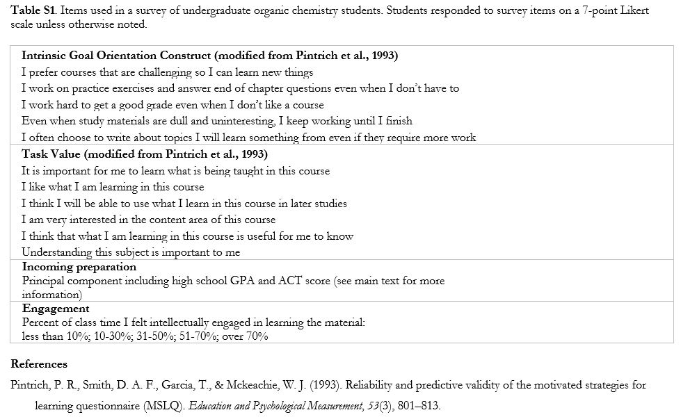
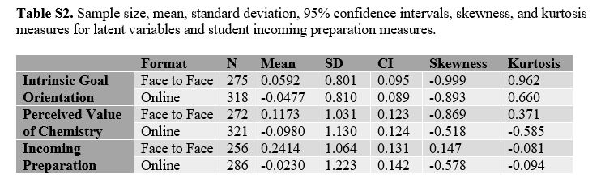

# Students who prefer face-to-face tests outperform their online peers in organic chemistry
 
Abby E. Beatty*, Abby Esco, Ash Curtiss, & Cissy J. Ballen  
*Corresponding author: aeb0084@auburn.edu

This repository holds all supplemental files for "Students who prefer face-to-face tests outperform their online peers in organic chemistry"

## Abstract: 
> "To test the hypothesis that students who complete remote online tests experience an ‘online grade penalty,’ we compared performance outcomes of second-year students who elected to complete exams online to those who completed face-to-face, paper-based tests in an organic chemistry course. We pursued the following research questions: (RQ1) Are there performance gaps between students who elect to take online tests and those who take face-to-face tests? (RQ2) Do these two groups differ with respect to other affective or incoming performance attributes? How do these attributes relate to performance overall? (RQ3) How does performance differ between students who reported equal in-class engagement but selected different testing modes? (RQ4) Why do students prefer one testing mode over the other? We found that students who elected to take online tests consistently underperformed relative to those who took face-to-face tests. While we observed no difference between the two student groups with respect to their intrinsic goal orientation and incoming academic preparation, students who preferred face-to-face tests perceived chemistry as more valuable than students who preferred to complete exams online. We observed a positive correlation between performance outcomes and all affective factors. Among students who reported similar levels of in-class engagement, online testers underperformed relative to face-to-face testers. Open-ended responses revealed online testers were avoiding exposure to illness/COVID-19 and preferred the convenience of staying at home; the most common responses from face-to-face testers included the ability to perform and focus better in the classroom, and increased comfort or decreased stress they perceived while taking exams."

### Quick Key to File Directory: Detailed Descriptions of file use can be found below.

Note: The final data set used in analysis is available for public use. Additionally, deidentified raw survey data is available here. Due to IRB Restrictions all data files used in analysis that contain institutional information (Grades, GPA, etc.) prior to the final merged, and deidientified data are available upon direct request. Following approval, all deidentified data including institutional info will be shared directly.


Analysis and File Names| Brief Description | Link to File
-------------------------------------|------------------------------------ | -----------------------------------------------------
CHEM-master-file_Deidentified.xlsb   |Excel File Containing All Raw Survey Data  | [Raw Survey Data](CHEM-master-file_Deidentified.xlsb)
CHEM_deidentified.csv                |CSV File Use in R Statistical Analysis     | [CSV used in Statistical Analysis](CHEM_deidentified.csv)


## Supplementary Tables: 






## Statistical and Data Visualization Code
```ruby
#Load all necessary Packages
library(reshape2)
library(nlme)
library(ggplot2)
library(plyr)
library(emmeans)
library(devtools)
library(tidyverse)
library(corrplot)
library(GPArotation)
library(semPlot)
library(lavaan)
library(cowplot)
library(readr)
library(tidyr)
library(Hmisc)
library(RColorBrewer)
library(PupillometryR)
```

```ruby
#Load data files containing latent variables and institutional information. Merge the two data sets into a single data frame.
chem.cfa.raw=read.csv("CHEM_CFA.csv", header=T, na.strings = c("", "NA"))
chem.cfa.raw$GID<-toupper(chem.cfa.raw$GID) 

institut=read.csv("Institutional_info.csv")
#Institutional data was then used to merge with survey data. Note: ACTcalc is raw ACT values when available, and SAT values converted to ACT when no ACT was reported but SAT was.

chem.cfa <- merge(chem.cfa.raw,institut, by="GID", all=TRUE, incomparables = FALSE)
```
> Data is often scewed to the right. Only a couple of the data columns are normal. So data will need to be transformed. Go to this website to see alternitives to normalizing data within the cfa model: https://lavaan.ugent.be/tutorial/est.html
> "MLM": maximum likelihood estimation with robust standard errors and a Satorra-Bentler scaled test statistic. For complete data only.See this pub for justification of test statistic choice: https://citeseerx.ist.psu.edu/viewdoc/download?doi=10.1.1.382.6856&rep=rep1&type=pdf

# CONFIRMATORY FACTOR ANALYSIS OF PREVIOUSLY VALIDATED CONSTRUCTS
## CFA of Grit Measures
```ruby
#Grit alone

#Create model that contains all questions related to grit
(c1.model <- '
grit =~ G1 + G2 + G3 + G4 + G5')

#run confirmatory factor analysis on those questions using the MLM mode explained above
solution1 <- cfa(c1.model, data=chem.cfa, estimator= "MLM")

#Collect summary output, including all fitness measures based on the standardized outputs.
summary(solution1, fit.measures=T, standardized=TRUE)

#Produce SEM plot showing all estimates and standard deviations using the standardized values. 
  #label and text sizes were increased from default 0.8 to 1.0
semPlot::semPaths(solution1, "std", edge.label.cex =1, label.cex=1)

```

> Grit Measures did not meet the standard for CFA success using all variables. This will be redone, removing the lowest fit variable (V1)

### Try improving Model 1 by removing V1 (high variance and low estimate)
```ruby
#Grit
(c1b.model <- '
grit =~ G2 + G3 + G4 + G5')

solution1b <- cfa(c1b.model, data=chem.cfa, estimator= "MLM")
summary(solution1b,fit.measures=T, standardized=TRUE)
semPlot::semPaths(solution1b, "std", edge.label.cex =1, label.cex=1)

#Create index file of the factor scores collected from cfa. These will be adjust values to meet the loading determined for each survey question
idx <- lavInspect(solution1b, "case.idx")
fscores <- lavPredict(solution1b, type="lv")

## loop over factors and merge them with the original data set. All missing values will be input as "NA".
for (fs in colnames(fscores)) {
  chem.cfa[idx, fs] <- fscores[ , fs]
}

#preview the output to verify merge was successful
head(chem.cfa)

```
> Improvement of Model 1 was successful. These are the values that will be used for all future analyses. All parameters are within the cutoff when Variable 1 for grit is removed.


## CFA of Value Measures
```ruby
#See code above for annotation details.

#Values
(c3.model <- '
values =~ V1 + V2 + V3 + V4 + V5 + V6')

solution3 <- cfa(c3.model, data=chem.cfa, estimator= "MLM")
summary(solution3,fit.measures=T, standardized=TRUE)
semPlot::semPaths(solution3, "std", edge.label.cex =1, label.cex=1)

idx <- lavInspect(solution3, "case.idx")
fscores <- lavPredict(solution3, type="lv")
## loop over factors
for (fs in colnames(fscores)) {
  chem.cfa[idx, fs] <- fscores[ , fs]
}
head(chem.cfa)

```

> for notes on how to produce and interpret semPlots, see : https://www.r-bloggers.com/2018/04/statistics-sunday-using-semplot/
https://cran.r-project.org/web/packages/semPlot/semPlot.pdf
http://sachaepskamp.com/documentation/semPlot/semPaths.html

> #CFI: Measures whether the model fits the data better than a more restricted baseline model. Higher is better, with okay fit > .9. Find CFI under User Model vs. Baseline model

> #TLI (Tucker-Lewis index): Similar to CFI, but it penalizes overly complex models (making it more conservative than CFI). Measures whether the model fits the data better than a more restricted baseline model. Higher is better, with okay fit > .9.

> #Find Test statistic, DOF, and P value under Model Test User Model (chi-squared goodness of fit test)

> #RMSEA p value:The RMSEA P-value is the Probability that RMSEA <= .05. If that P-value is greater than 5% you can argue that the RMSEA value does not indicate a model rejection (the RMSEA value doesn't reject the model if the RMSEA value is between 0 and 0.05). Usually this is useful when the RMSEA value is near the cutoff value of 0.05. If the RMSEA value is not near 0.05 one can typically ignore the confidence limit and the P-value and simply use the actual RMSEA value.

> #std.all are the standardized coefficients

> See this publication and references within on reporting CFA results properly: https://www.researchgate.net/publication/24187223_Reporting_Practices_in_Confirmatory_Factor_Analysis_An_Overview_and_Some_Recommendations

## Incoming Preparation Measures
```ruby
#Design a data set for PCA analysis. The goal of this is to combine multiple highly correlated variables of incoming preparation.
#subset whole data to include all data points which have ACT and High school GPA measures available. Cumulative GPA when entering class was also available, and included in the data set.

#Note: Most students had ACT scores available, but some did not. When ACT was not available, but SAT was, SAT scores were converted to ACT scores using ACT.org "SAT Concordance Tables". 
PCA=chem.cfa[complete.cases(chem.cfa$ACTcalc),]
PCA2=PCA[complete.cases(PCA$HS_GPA),]
#cumulative GPA coming into the class was also at one point included, but this data was not available for many student and the courses taken likely vary extensively. This variable was then not included in the final analysis. 
PCA3=PCA2[complete.cases(PCA2$CUM_GPA),]

#Sanity check: ACT score and high school GPA were highly correlated.
cor.test(PCA3$HS_GPA, PCA3$ACTcalc)

#Run PCA analysis on ACT score and high school GPA.
perf=princomp(PCA3[28:29], cor=T, scores=TRUE)
#Display results including the PC loadings
summary(perf, loadings=T)

#Plot PCA results 
#PCA.pl=autoplot(perf, loadings= T, loadings.label=T)
#PCA.pl

#Add PCA scores as a new column in the PCA dataframe
PCA3=cbind(PCA3, perf$scores)

#NOW MERGE THIS COLUMN TO THE ORIGINAL DATA SET.
PCA4=select(PCA3, GID, Comp.1)
chem.cfa <- merge(chem.cfa,PCA4, by="GID", all=TRUE)
```
```ruby#Rename Comp.1 from PCA to "Prep"
rename(chem.cfa, Prep = Comp.1)
```


## Write new data frame with Loaded Latent Variable Values
```ruby
write.csv(chem.cfa,"CFA_Loadings.csv", row.names = FALSE)

#This data was exported to have a grit, anxiety, values, and incoming preparation score for each student. That data was then converted to "long" format in excel, and extraneous variables were removed from the data set.

```

# Determine that performance does not differ between fall and summer semesters before combining data. 
```{r}
chem=read.csv("CHEM_long2.csv")
table(chem$Exam, chem$Format)
ID.unique=as.data.frame(table(chem$ID))

anova(lme(Performance~ semester.x, random= ~1|ID, data=chem, na.action=na.omit))
```

> There is not a statistical difference between the two semesters, and they are therefore combined.

# Test for Outliers, and retrieve statistical measures of data quality for latent variables
```ruby
#outlier test
outlierTest(lm(Performance~ Format+ Exam + Grit + Anxiety + Values, data=chem, na.action=na.omit))

summarySE(data=chem, measurevar="Grit", groupvars="Format", na.rm=T, conf.interval=0.95)
summarySE(data=chem, measurevar="Values", groupvars="Format", na.rm=T, conf.interval=0.95)
summarySE(data=chem, measurevar="Prep", groupvars="Format", na.rm=T, conf.interval=0.95)

f2f=subset(chem, Format == "Face to Face")
online=subset(chem, Format == "Online")

skew(f2f$Grit)
kurtosi(f2f$Grit)
skew(f2f$Values)
kurtosi(f2f$Values)
skew(f2f$Prep)
kurtosi(f2f$Prep)
skew(online$Grit)
kurtosi(online$Grit)
skew(online$Values)
kurtosi(online$Values)
skew(online$Prep)
kurtosi(online$Prep)
```
# Quantitative Analysis
```ruby
#read in longitudinal repeated measures data set including all data
chem=read.csv("CHEM_long2.csv")
table(chem$Exam, chem$Format)
ID.unique=as.data.frame(table(chem$ID))

table(ID.unique$Var2)

#Set dodge positions for plotting
dodge <- position_dodge(width = 0.6)

#Research Question 1: Were there performance gaps between the two groups? 
#Research Question 2: Were there differences in affective measures between the two groups and based on performance?

#run linear model to determine which available variables may affect performance in the course
chem.lm=(lme(Performance~ Format+ Exam + Grit + Anxiety + Values + Prep, random= ~1|ID/semester.x, data=chem, na.action=na.omit))
anova(chem.lm)
summary(chem.lm)

chem.lm2=(lme(Performance~ Format+ Exam + Grit + Anxiety + Values, random=list(~1|ID, ~1|Prep), data=chem, na.action=na.omit))
anova(chem.lm2)
summary(chem.lm2)

#run linear model examining testing format on performance when correcting for incoming preparation.
anova(lme(Performance~ Format, random=list(~1|ID, ~1|Prep), data=chem, na.action=na.omit))
anova(lme(Performance~ Format*Exam, random=list(~1|ID, ~1|Prep), data=chem, na.action=na.omit))


#Single Model Analysis

chem.lm3=(lme(Performance~ Format+ Exam + Grit + Anxiety + Values, random=list(~1|ID, ~1|Prep), data=chem, na.action=na.omit))
anova(chem.lm3)
summary(chem.lm3)


```

> Class form, exam number, grit, anxiety, values, and incoming preparation all significantly effected performance in the course when taking "ID" into account as a repeated measure.  Because incoming prepartion has a clear affect on performance, and our focus is on how the two testing formats effect performance, a second linear model was performed examining the effect of testing format on performance when incominging preparation is taken into account.  Even when incoming preparation is taken into account, testing format significantly effected class performance. 

```ruby
#make a data frame that includes all student data for which we have testing format designations. 
format= chem %>% drop_na(Format)

#design a raincloud theme for plotting performance data. 
raincloud_theme = theme(
text = element_text(size = 10),
axis.title.x = element_text(size = 16),
axis.title.y = element_text(size = 16),
axis.text = element_text(size = 12),
#axis.text.x = element_text(angle = 45, vjust = 0.5),
legend.title=element_text(size=16),
legend.text=element_text(size=16),
legend.position = "right",
plot.title = element_text(lineheight=.8, face="bold", size = 16),
panel.border = element_blank(),
#panel.grid.minor = element_blank(),
#panel.grid.major = element_blank(),
axis.line.x = element_line(colour = 'black', size=0.5, linetype='solid'),
axis.line.y = element_line(colour = 'black', size=0.5, linetype='solid'))

#Set calculations for upper and lower boundaries
lb <- function(x) mean(x) - sd(x)
ub <- function(x) mean(x) + sd(x)

#use ddply package to calculate means, median, lower and upper boundaries for Performance of students, for each format.
sumld<- ddply(format, ~Format, summarise, mean = mean(Performance), median = median(Performance), lower = lb(Performance), upper = ub(Performance))


#Plot performance by format. Raincloud plots were designed to show a point distribution of data with an overlaying boxplot alongside a density plot distribution.

rain2=ggplot(data = format, aes(y = Performance, x = Format, fill = Format)) +
geom_flat_violin(position = position_nudge(x = .2, y = 0), alpha = .8, width=.4) +
geom_point(aes(y = Performance, color = Format), position = position_jitter(width = .15), size = 1, alpha = 0.6) +
geom_boxplot(width = .15, guides = FALSE, outlier.shape = NA, alpha = 0.5) +
expand_limits(x = 2) +
guides(fill = FALSE) +
guides(color = FALSE) +
  scale_fill_manual(values = c("thistle3", "skyblue4")) +
  scale_color_manual(values = c("thistle3", "skyblue4")) +
       theme(strip.text.x = element_text(size = 16, face = "bold"))+
raincloud_theme 

rain2

ggsave(rain2, file="rain_perf_average.png", height=8, width=4, dpi = 300)


rain=ggplot(data = format, aes(y = Performance, x = Format, fill = Format)) +
geom_flat_violin(position = position_nudge(x = .2, y = 0), alpha = .8, width=.4) +
geom_point(aes(y = Performance, color = Format), position = position_jitter(width = .15), size = 1, alpha = 0.6) +
geom_boxplot(width = .15, guides = FALSE, outlier.shape = NA, alpha = 0.5) +
expand_limits(x = 2) +
guides(fill = FALSE) +
guides(color = FALSE) +
  scale_fill_manual(values = c("thistle3", "skyblue4")) +
  scale_color_manual(values = c("thistle3", "skyblue4")) +
       theme(strip.text.x = element_text(size = 16, face = "bold"))+
raincloud_theme +
  coord_flip()+
  facet_wrap(~Exam,   dir = "v")


ggsave(rain, file="rain_perf.png", height=8, width=8, dpi = 300)
```

# Multipanel Figure of Affective measures
```ruby

aff=subset(chem, Exam== "Exam 1")
aff=chem[, c(2,6,22,24:25)]

df_melted = melt(aff, id.vars=c("ID", "Format"), variable.name="Construct", value.name="Value")
df_melted=df_melted[complete.cases(df_melted),]
```


```ruby
anova(lme(Grit~ Format, data=aff, random=~1|ID, na.action=na.omit))
anova(lme(Prep~ Format, data=aff, random=~1|ID, na.action=na.omit))
anova(lme(Values~ Format, data=aff, random=~1|ID, na.action=na.omit))


p1=ggplot(df_melted, aes(x = Format, y = Value, fill=Format)) +
 geom_violin(trim=F, position= dodge, scale="width") + 
  scale_fill_manual(values = c("thistle3", "skyblue4")) +
  geom_boxplot(width=0.15, position= dodge, outlier.shape = NA, color="black") +
  geom_point(position=position_jitterdodge(jitter.width = 0.05, dodge.width = 0.6), size=1, alpha=0.3) +
  ylab("Factor Score")+
  theme(strip.text.x = element_text(size = 12, face = "bold"),
        axis.title = element_text(size=11, face="bold")) +
  facet_wrap(~Construct, scales = "free")

ggsave(p1, file="Affect.png", width=8, height=4, dpi=300)
p1


```

```ruby

cor.test(format$Values, format$Performance)
cor.test(format$Grit, format$Performance)
cor.test(format$Prep, format$Performance)


cor.val=ggplot() + 
  geom_point(data=format, aes(x=Performance, y=Values, color=Format)) +
  scale_color_manual(values = c("thistle3", "skyblue4")) +
  geom_smooth(data=format, aes(x=Performance, y = Values), method=lm, color="black") +
  theme(legend.position="none")

ggsave(cor.val, file="cor.val.png", height=2, width=3, dpi = 300)


cor.grit=ggplot() + 
  geom_point(data=format, aes(x=Performance, y=Grit, color=Format)) +
  scale_color_manual(values = c("thistle3", "skyblue4")) +
  geom_smooth(data=format, aes(x=Performance, y = Grit), method=lm, color="black") +
    theme(legend.position="none")


ggsave(cor.grit, file="cor.grit.png", height=2, width=3, dpi = 300)

cor.prep=ggplot() + 
  geom_point(data=format, aes(x=Performance, y=Prep, color=Format)) +
  scale_color_manual(values = c("thistle3", "skyblue4")) +
  geom_smooth(data=format, aes(x=Performance, y = Prep), method=lm, color="black") +
    theme(legend.position="none")


ggsave(cor.prep, file="cor.prep.png", height=2, width=3, dpi = 300)

```

# Create visual depiction of categorical engagement by performance effects
```ruby
#Upload long data including additional variables for visual analysis only
sec_var=read.csv("CHEM_long.csv")

#histogram of engagement between formats

eng= sec_var %>% drop_na(engagement)
eng= eng %>% drop_na(Format)

eng.pl=ggplot(eng, aes(x=engagement, fill=Format)) + 
  geom_bar(position="fill") +
    scale_fill_manual(values = c("thistle3", "skyblue4")) +
  ylab("Frequency")+
  coord_flip() +
  xlab("Engagement")

eng.pl 
ggsave(eng.pl, file="eng.png", height=6, width=4, dpi = 300)

eng.lm=(lme(Performance~ engagement*Format, random= ~1|ID, data=eng, na.action=na.omit))
anova(eng.lm)

emmeans(eng.lm, list(Format~engagement), adjust = "tukey")

eng1=subset(eng, engagement== "<10%")
eng2=subset(eng, engagement== "10-30%")
eng3=subset(eng, engagement== "31-50%")
eng4=subset(eng, engagement== "51-70%")
eng5=subset(eng, engagement== "71-100%")

anova(lme(Performance~ Format, random= ~1|ID, data=eng1, na.action=na.omit))
anova(lme(Performance~ Format, random= ~1|ID, data=eng2, na.action=na.omit))
anova(lme(Performance~ Format, random= ~1|ID, data=eng3, na.action=na.omit))
anova(lme(Performance~ Format, random= ~1|ID, data=eng4, na.action=na.omit))
anova(lme(Performance~ Format, random= ~1|ID, data=eng5, na.action=na.omit))


eng.pl2=ggplot(data=eng, aes(x=engagement, y=Performance, group=Format, color=Format)) + 
  geom_smooth(stat='summary', fun.y='mean') + 
  geom_point(stat='summary', fun.y='mean') +
  scale_color_manual(values = c("thistle3", "skyblue4")) +
  xlab("Engagement")

ggsave(eng.pl2, file="eng2.png", height=4, width=6, dpi = 300)
eng.pl2


his=ggplot(eng, aes(x=engagement, fill=Format)) + 
  geom_bar(position="dodge", width=0.5) +
    scale_fill_manual(values = c("thistle3", "skyblue4")) +
  ylab("Frequency")+
  xlab("Engagement")

his 
ggsave(his, file="his.eng.png", height=2, width=6, dpi = 300)
```
# Calculate Descriptive Demographic Statistics 
```ruby

demo.o=subset(chem, Format=="Online")
demo.f=subset(chem, Format == "Face to Face")
  

library(janitor)

tabyl(chem, gender, Format) %>%
  adorn_percentages("col") %>%
  adorn_pct_formatting(digits = 1)

tabyl(chem, class, Format) %>%
  adorn_percentages("col") %>%
  adorn_pct_formatting(digits = 1)

tabyl(chem, race, Format) %>%
  adorn_percentages("col") %>%
  adorn_pct_formatting(digits = 1)

tabyl(chem, first_generation, Format) %>%
  adorn_percentages("col") %>%
  adorn_pct_formatting(digits = 1)


```
